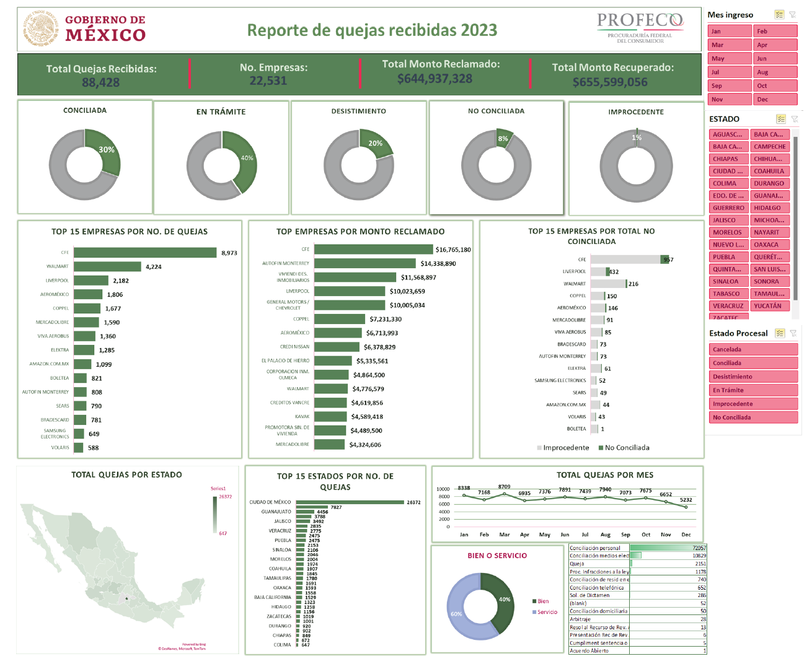

# Report of Complaints Filed with Profeco During 2023
The Federal Consumer Protection Agency (PROFECO) is a public agency of the Government of Mexico whose objective is to protect the rights of consumers, prevent abuses and guarantee fair consumer relations.

Each year, around 100 thousand complaints are filed with PROFECO by consumers against different companies. The objective of this project is to generate a report dashboard in excel to summarize and understand the main data of the complaints filed with PROFECO during 2023.

Among other data, this dashboard shows both specific information such as total complaints received or the Total amount claimed/recovered, as well as information about the companies with the highest number of claims, or the companies with the highest amount claimed. In addition, this information can be quickly filtered by various selectors such as the month of entry, the state where the complaint was made or the procedural status in which each complaint is found.

To see the full version, download the excel file.

## Filtering Options
Month of entry: You can filter the data by the month in which the complaint was filed.
* **State:** You can filter the data by the state in which the complaint was filed.
* **Procedural status:** You can filter the data by the procedural status of the complaint, such as "in process", "resolved" or "dismissed".

## How to Use the Dashboard
The dashboard is easy to use. Simply select the filters you want to apply and the dashboard will automatically update the data. You can also download the excel file to see the full version of the report.

# Conclusion
This dashboard is a valuable tool for understanding the main data of the complaints filed with PROFECO during 2023. The information can be used by consumers to make informed decisions about their purchases, by companies to improve their customer service, and by policymakers to develop better consumer protection laws.
